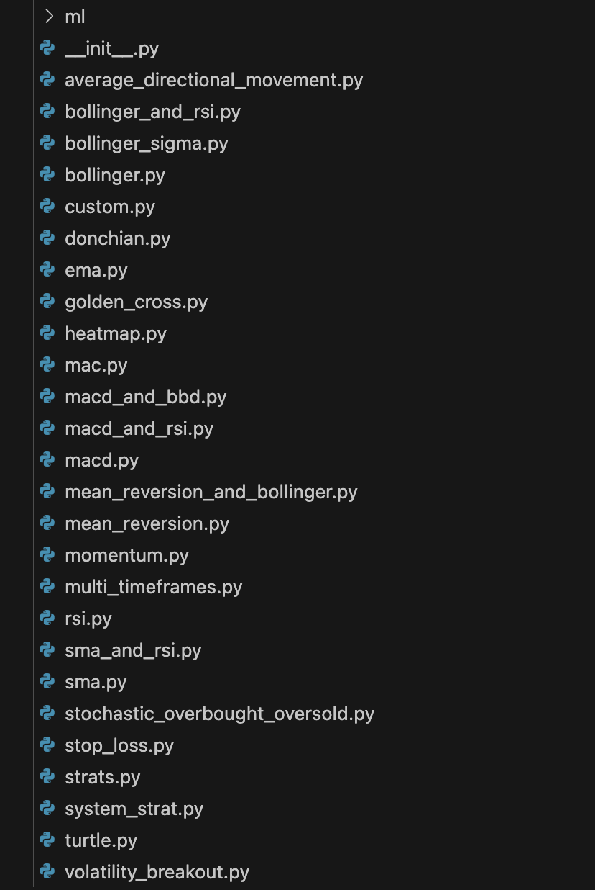
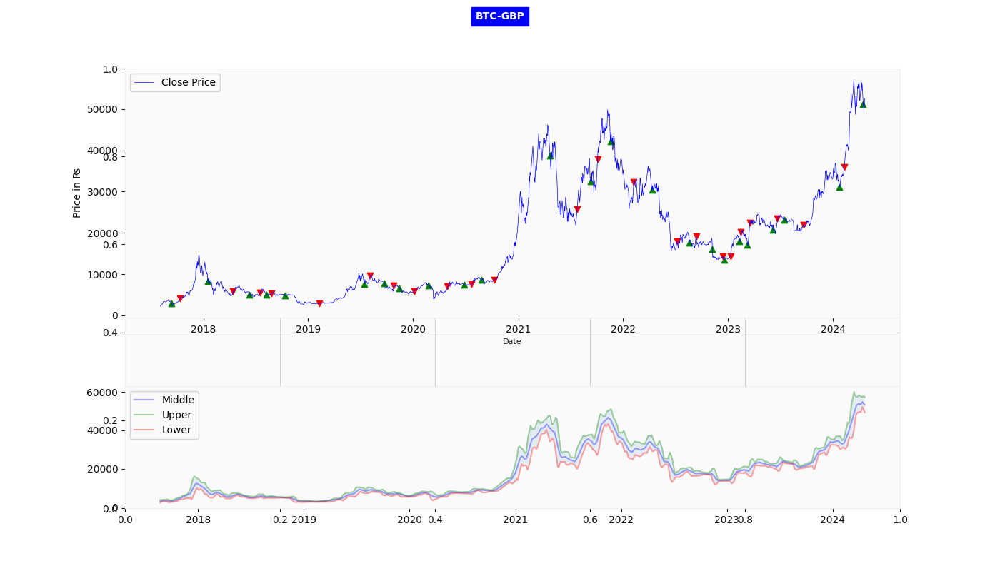
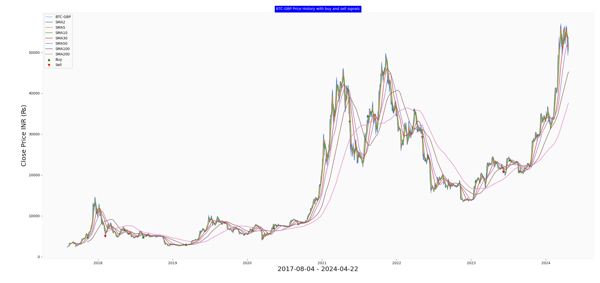
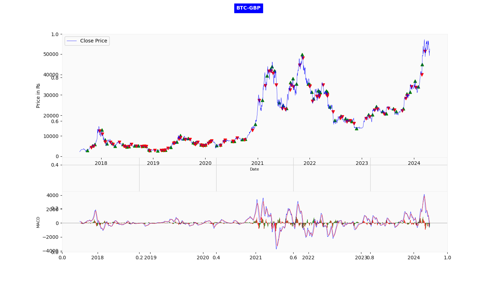

# backtesting-ms

## Strategies

### Bollinger Bands

### Simple Moving Average (SMA)

**Sample stategy**
- 10-day SMA below 30-day SMA.
- 10-day and 30-day SMA above 50-day SMA.
- 10-day, 30-day, and 50-day SMA below 200-day SMA.

### The Moving Average Convergence/Divergence indicator

Purpose: Entry/exit points; trend confirmation; and risk management.

2 conditions:
- MACD above the MACD signal.
- MACD greater than 0.

The MACD indicator is derived from two exponential moving averages (EMAs) — the 12-day EMA and the 26-day EMA. The formula for MACD is as follows:

``MACDLine=12−dayEMA−26−dayEMA``

A signal line, often a 9-day EMA, is plotted on top of the MACD line. This signal line serves as a trigger for buy or sell signals.

``SignalLine=9−dayEMA``

The MACD histogram, the visual representation of the difference between the MACD line and the signal line, provides insights into the strength and direction of the trend.

``MACDHistogram=MACDLine−SignalLine``

## Backtesting Data

***DOGE:** [Kaggle](https://www.kaggle.com/datasets/svaningelgem/crypto-currencies-daily-prices?select=DOGE.csv)